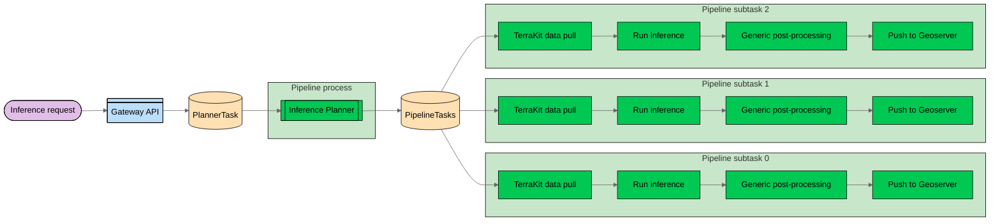
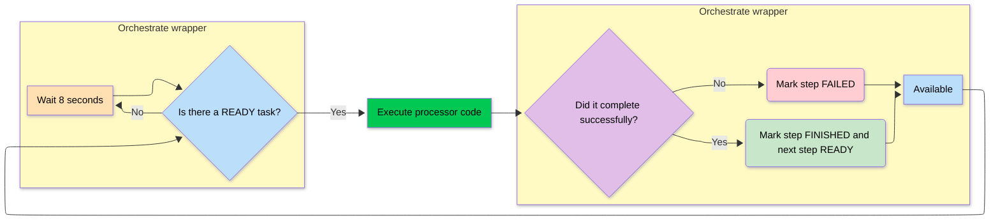

# DEPRECATED DEPRECATED DEPRECATED DEPRECATED DEPRECATED DEPRECATED DEPRECATED DEPRECATED DEPRECATED DEPRECATED

Please use the core repository
[https://github.com/terrastackai/geospatial-studio-core/tree/main/pipelines](https://github.com/terrastackai/geospatial-studio-core/tree/main/pipelines)  

# DEPRECATED DEPRECATED DEPRECATED DEPRECATED DEPRECATED DEPRECATED DEPRECATED DEPRECATED DEPRECATED DEPRECATED


# 🌍 GEO Studio: Pipelines


[](https://github.com/terrastackai/terratorch)
[](https://github.com/terrastackai/terrakit)
[](https://github.com/terrastackai/iterate)
[](https://github.com/claimed-framework)


[](https://terrastackai.github.io/geospatial-studio)

---

## 🚀 Overview
The pipelines engine of the Geospatial Studio is a collection of modular processing steps which can be orchestrated to pull and prepare data to input for AI models, run inference (with deployed or ephemeral models) and customisable post-processing steps.

When an inference request is received, an inference planning step will search for available data and plan a series of tasks which, generally, split the overall workflow by sub-bounding boxes and dates, which can then be run in parallel.



Each pipeline component is a python script built as a container, which includes the code to pick up tasks from the orchestration database.  The components are deployed as microservices on the k8s/Red Hat Openshift and can be scaled up and down to support changing workloads, with different components scale independently dependent of their resource requirements.

When idle, the deployed pipeline components will constantly check for new tasks which it could pick up.  Tasks can be assigned priority level to move up or down the queue.  Functionality to deploy different queues is also possible, but not yet implemented in the Geospatial Studio.


<!-- ## Features -->


## 🔀 Pipeline orchestration

The pipelines run through a series of microservices which are deployed on the openshift cluster and can be scaled up and down (currently manual) depending on the load.  Each task have a series of pipeline steps, defined in the following way:
```json
[
  {"status":"READY","process_id":"terrakit-data-fetch","step_number":0},
  {"status":"WAITING","process_id":"run-inference","step_number":1},
  {"status":"WAITING","process_id":"postprocess-generic","step_number":2},
  {"status":"WAITING","process_id":"push-to-geoserver","step_number":3}
]
```

Within the microservices there is the core processing code (mainly python scripts), which is executed by the `orchestrate_wrapper.py` script.  

This script:
1. checks the [task table](#inference-task-table) (in the orchestration db) for any tasks where it's `process_id` is in the `READY` state.
2. * if there are no tasks ready, it will wait and try again a few seconds later (#1).
   * if it finds a task waiting, it will change the status to `RUNNING`, then execute the process code (e.g. to query data, run inferece).  
3. * Once the code finishes, the wrapper will update the status of that step in the DB to `FINISHED` if successful, then mark the next step as `READY` and it should get picked up by the next process.  
   * If the code errors, it should mark the step as `FAILED` and the pipeline should stop.




Functionality will be added in the near future to:
* enable fan-in/fan-out in pipelines.


## 💻 Getting started

If you don't have access to a deployed version of the Geospatial Studio, the easiest way to get started with the pipelines is to deploy a version locally, this is particularly useful for developing new pipeline components.

--> [Deployment instructions](https://github.com/terrastackai/geospatial-studio)

## 💠 Existing pipeline componenets

|        Name    |                  Description                    |
|      :------  | :----------------------------------------------|
| Planner  | Orchestrates tasks by breaking down the inference job based on spatio-temporal queries |
| Terrakit data pull | Acquires remote sensing data required for inferencing. Uses data connectors such as nasa earthdata, sentinel aws, sentinelhub, etc |
| Url connector| Process user provided geospatial data |
| Run inference | Execute inference on a detached inferencing service|
| Terratorch inference  | Utilizes terratorch to perform model predictions |
| Postprocess generic | Masks prediction results; denoting features such as cloud cover, permanent water, ice, snow etc
| Push to geospatial store | Uploads the input and prediction results to a geospatial store for sharing and visualization |

## 🛠 Developing new pipeline components

To build a process component, you can use CLAIMED to build the container image from the python script.  You will likely need to read the [inference configuration](components/template_process/inference_config_template.json) and [task configuration](components/template_process/task_config_template.json) from the folder and an example of how to do that can be seen in the [template process script](components/template_process/template_process.py).

The process script should read the configurations and possibly data output from the previous pipeline steps (catalogued in the task config file).  It should then update the task config at the end to include details of any new layers/data products calculated.

### 🧱 Steps to build a new component

Follow the instructions in the [template process](components/template_process).  That folder provides a template for creating a new process component.

<!-- 1. Create a new folder in the components directory (in theory could be done anywhere).
2. Create a python script which will contain the process code.  There is a template file which can be used which includes the required headers for CLAIMED, importing the core inference pipeline environment variables, reading the inference and task configs and adding information to the task config at the end of the run.
3. Copy the `Dockerfile.template` into the component folder
4. Copy the `orchestrate_wrapper` folder into the component folder
5. Copy any other required libraries/scripts into the component folder -->

## 📜 Appendix

### Inference Task Table

Snippet of an inference task with task_id 6f031be7-86b5-4128-b23e-857dfcc65a25-task_0

This task has two subtasks: url-connector and push-to-geoserver.

| pipeline_steps | status | inference_id | task_id | inference_folder | priority | queue |
| :------        | :----- | :----------- | :------ | :--------------- | :------  | :---- |
| [{"status":"RUNNING","process_id":"url-connector","step_number":0}, {"status":"READY","process_id":"push-to-geoserver","step_number":1}] | RUNNING | 6f031be7-86b5-4128-b23e-857dfcc65a25 | 6f031be7-86b5-4128-b23e-857dfcc65a25-task_0 | /data/6f031be7-86b5-4128-b23e-857dfcc65a25 | 5 | |


